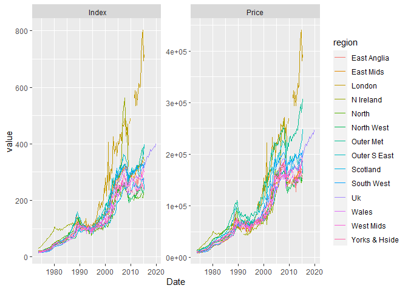

<!-- README.md is generated from README.Rmd. Please edit that file -->

# nationwider

<!-- badges: start -->

[](https://CRAN.R-project.org/package=nationwider)
[](https://www.tidyverse.org/lifecycle/#maturing)
[](https://travis-ci.org/kvasilopoulos/nationwider)
[](https://ci.appveyor.com/project/kvasilopoulos/nationwider)
[](https://codecov.io/gh/kvasilopoulos/nationwider?branch=master)
<!-- badges: end -->

The goal of {nationwider} is to provide house price data from
[\<nationwide.co.uk\>](https://www.nationwide.co.uk/). All datasets
available have been curated using tidytools and returned in a convenient
rectangular tidy format.

## Installation

You can install the development version from
[GitHub](https://github.com/) with:

``` r
# install.packages("devtools")
devtools::install_github("kvasilopoulos/nationwider")
```

## Example

This is a basic example on how to download data with {nationwider}.

``` r
library(nationwider)

np <- nationwider::ntwd_get("new_prop")
np
#> # A tibble: 5,124 x 4
#>    Date       region type   value
#>    <date>     <chr>  <chr>  <dbl>
#>  1 1973-10-01 North  Price 13528.
#>  2 1974-01-01 North  Price 13928.
#>  3 1974-04-01 North  Price 14119.
#>  4 1974-07-01 North  Price 13624.
#>  5 1974-10-01 North  Price 14838.
#>  6 1975-01-01 North  Price 14966.
#>  7 1975-04-01 North  Price 15716.
#>  8 1975-07-01 North  Price 16084.
#>  9 1975-10-01 North  Price 17569.
#> 10 1976-01-01 North  Price 18096.
#> # ... with 5,114 more rows
```

We reshape our data from the initial form into a wider form.

``` r
library(dplyr)
#> 
#> Attaching package: 'dplyr'
#> The following objects are masked from 'package:stats':
#> 
#>     filter, lag
#> The following objects are masked from 'package:base':
#> 
#>     intersect, setdiff, setequal, union
library(tidyr)

np %>% 
  dplyr::filter(type == "Price") %>% 
  spread(region,value)
#> # A tibble: 183 x 16
#>    Date       type  `East Anglia` `East Mids` London `N Ireland`  North
#>    <date>     <chr>         <dbl>       <dbl>  <dbl>       <dbl>  <dbl>
#>  1 1973-10-01 Price         9375.       8860. 11780.      13598. 13528.
#>  2 1974-01-01 Price         9275.       8879. 11827.      15334. 13928.
#>  3 1974-04-01 Price         9549.       8967. 12077.      15931. 14119.
#>  4 1974-07-01 Price         9494.       8850. 12390.      16889. 13624.
#>  5 1974-10-01 Price         9531.       8937. 12265.      17522. 14838.
#>  6 1975-01-01 Price         9779.       9054. 12234.      18209. 14966.
#>  7 1975-04-01 Price         9953.       9539. 12468.      19548. 15716.
#>  8 1975-07-01 Price         9907.       9617. 12843.      20578. 16084.
#>  9 1975-10-01 Price        10393.       9762. 13273.      22622. 17569.
#> 10 1976-01-01 Price        10438.       9985. 13187.      23761. 18096.
#> # ... with 173 more rows, and 9 more variables: `North West` <dbl>, `Outer
#> #   Met` <dbl>, `Outer S East` <dbl>, Scotland <dbl>, `South West` <dbl>,
#> #   Uk <dbl>, Wales <dbl>, `West Mids` <dbl>, `Yorks & Hside` <dbl>
```

Here we are plotting all regions using type `Index` and `Price` as
facets.

``` r
library(ggplot2)
np %>% 
  ggplot(aes(Date, value, col = region)) +
  geom_line() +
  facet_wrap(~ type, scales = "free")
```


